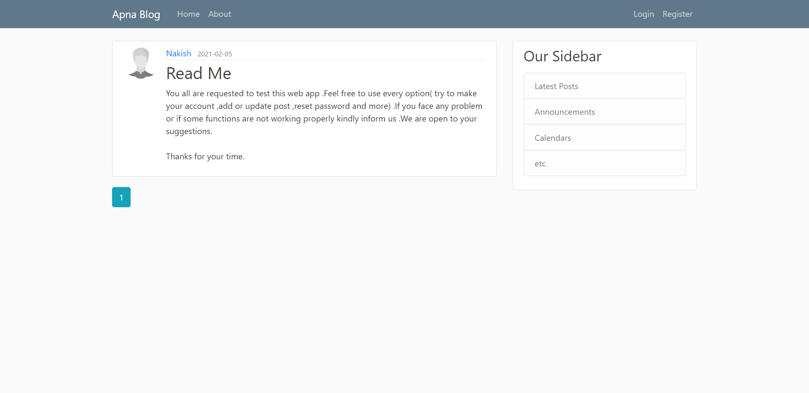
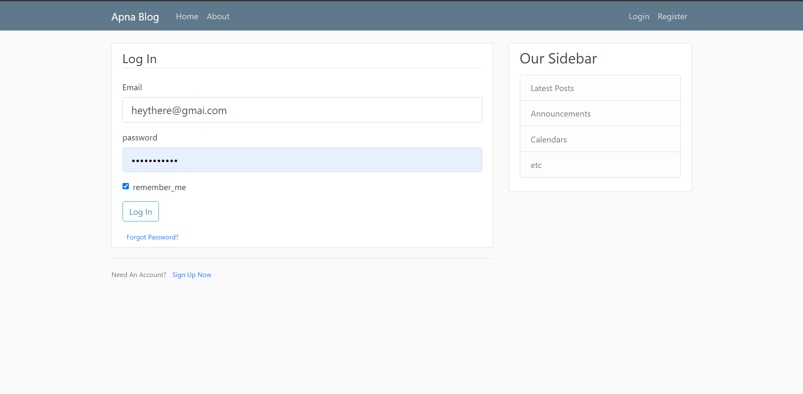
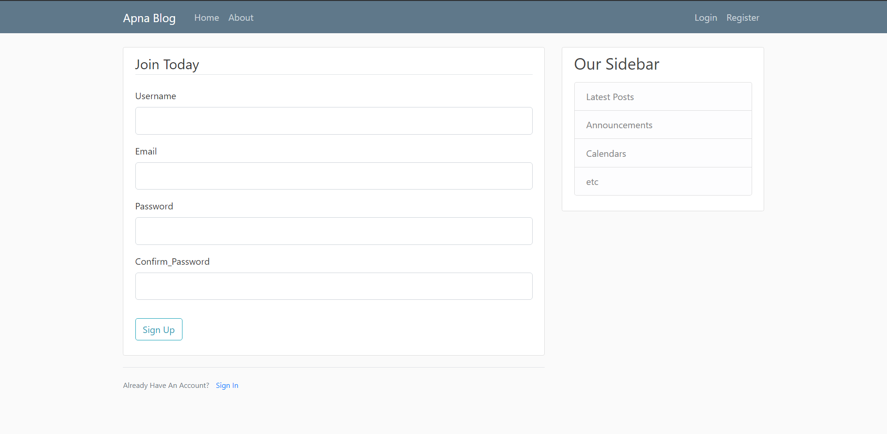

# Apna blog : Flask Application

I have developed a dynamic blog site using the Flask framework. The site features various sections such as home, about, login, and register, providing a seamless user experience. It has been successfully deployed on Heroku, making it easily accessible to users online. 
.
  
## Screenshots

 

 

  
